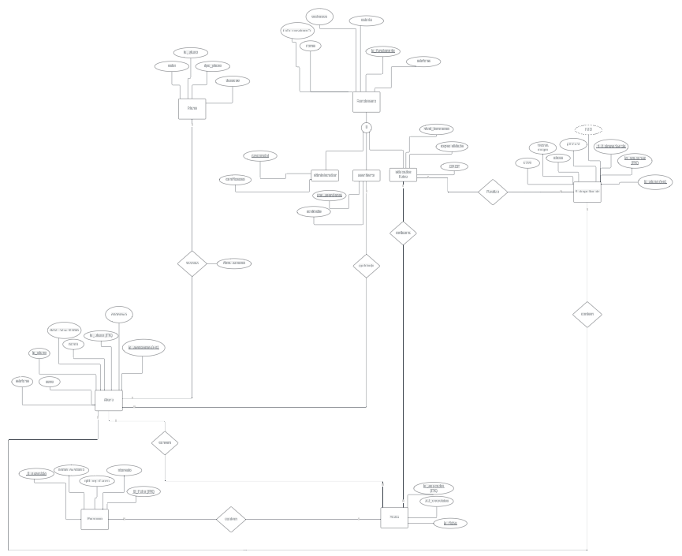
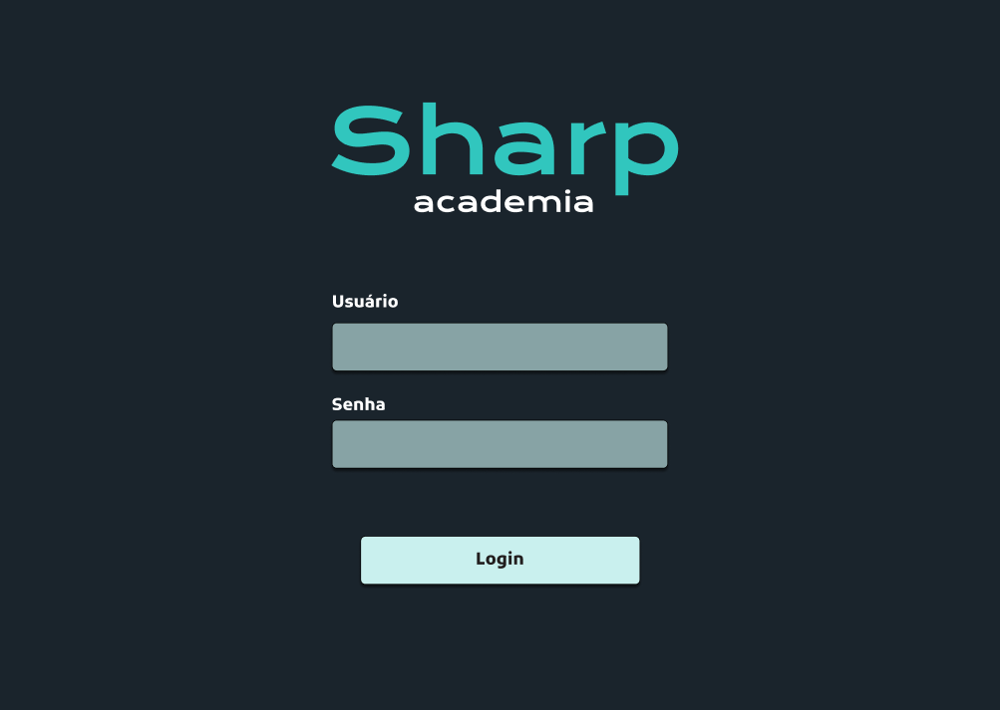
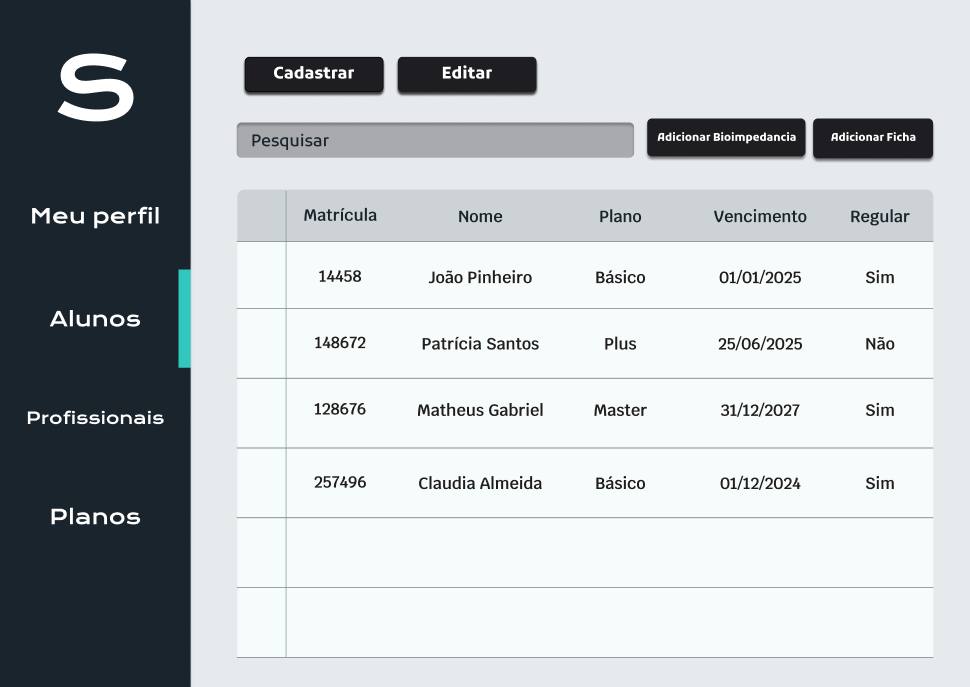
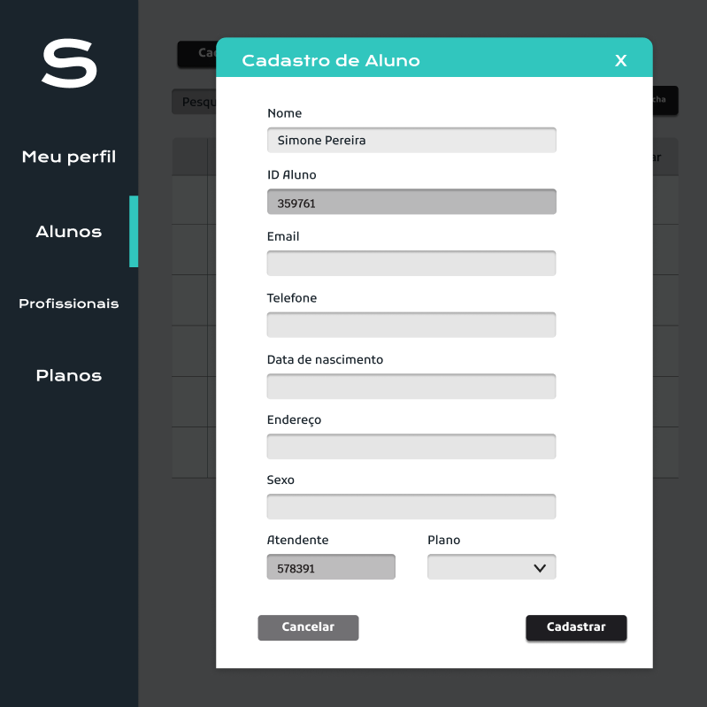
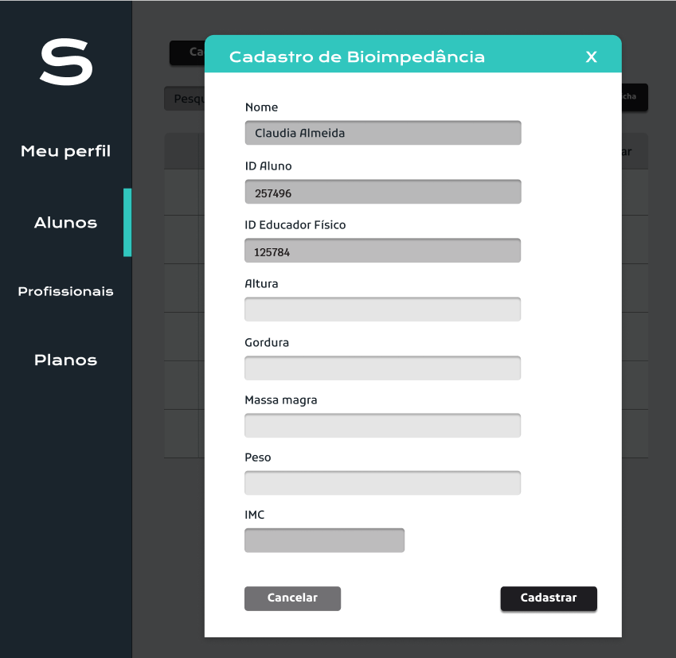
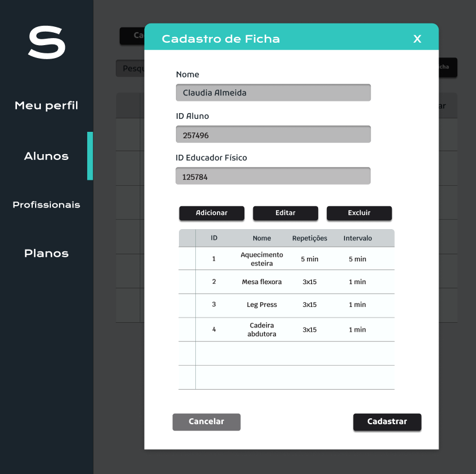

## 4. Projeto da Solução

Pré-requisitos: <a href="./3-Modelagem-Processos-Negócio.md"> Modelagem do Processo de Negocio</a>

## 4.1. Arquitetura da solução

 

Visualização da mogelagem de dados: <a href="https://lucid.app/lucidchart/1ec70c2a-fa5e-4f5b-8113-9810d3d45749/edit?invitationId=inv_272cbafc-36f1-4a20-95a4-e285f7a166bd&page=0_0#"> Lucid Chart</a>

### 4.2. Protótipos de telas

Visualização dos protótipos: <a href="https://www.figma.com/design/xUmgR046lpLvg3MAjhGitC/Untitled?node-id=0-1&p=f&t=lHrlWq4AVnVkIlxh-0"> Figma - Academia Sharp</a>

#### Protótipo Login

#### Protótipo Alunos

#### Protótipo Cadastro Aluno

#### Protótipo Cadastro Bioimpedancia

#### Protótipo Cadastro Ficha

#### Protótipo Cadastro Ficha

### 4.4. Tecnologias

| **Dimensão**                   | **Tecnologia**  |
| ---                            | ---             |
| SGBD                           | MySQL           |
| Modelagem de processos         | Camunda         |
| Prototipação                   | Figma           |
| Front end                      | Windows Forms   |
| Back end                       |  C#             |
| Deploy                         | Local           |

