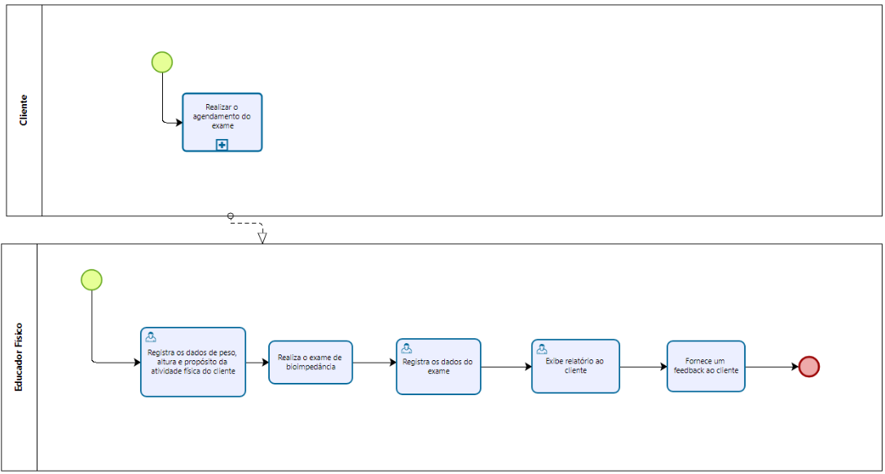

### 3.3.1 Processo 1 – BIOIMPEDANCIA

#### Cadastro de aluno:

O sistema propõe uma forma mais simplificada de cadastrar a bioimpedância do aluno de acordo com o seguinte processo:

#### Detalhamento das atividades

#### Processo TO-BE - Cadastro de bioimpedância
1. O cliente manifesta o interesse à recepcionista da academia que deseja realizar o exame de bioimpedância. 
2. A recepcionista informa os dias e horários disponíveis para realizar o exame, de acordo com o sistema de agendamentos. O cliente escolhe o dia e horário mais conveniente para ele. 
3. A recepcionista fornece informações sobre o exame e orienta em relação às recomendações. 
4. No dia do exame o cliente informa ao profissional de educação física o seu peso, idade e propósito com a atividade física e registra tais dados no sistema. 
5. O educador físico realiza o exame (equipamento de bioimpedância) e registra os dados no sistema. 
6. De acordo com os dados, o profissional exibe um relatório informatizado ao cliente e fornece a ele um feedback.

