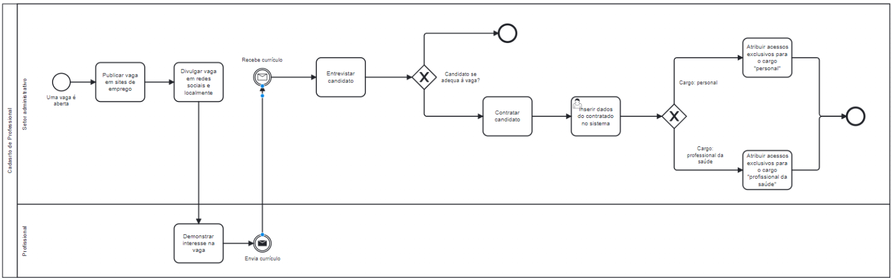

### 3.3.1 Processo 4 – CADASTRO PROFISSONAL

#### Cadastro de aluno:

O sistema propõe uma forma mais simplificada de cadastrar um profissional de acordo com o seguinte processo:

#### Detalhamento das atividades

#### Processo TO-BE - Cadastro de profissional
1. Uma vaga é publicada em sites de emprego
2. A vaga é divulgada em redes sociais e localmente
3. Um candidato demonstra interesse na vaga
4. O currículo é enviado pelo candidato e recebido pelo setor administrativo
5. Se o candidato se adequar a vaga, o setor administrativo contrata o candidato. Se não, o processo é encerrado
